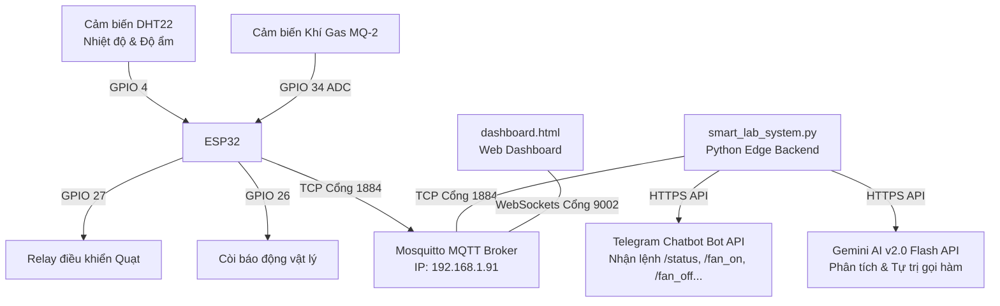

# 🚨 RubyAlert: Hệ Thống Giám Sát Cảnh Báo Phòng Lab AIoT Thông Minh


> **Đồ án Đa ngành / Dự án Nghiên cứu Cải tiến Công nghệ AIoT**  
> **Kiến trúc:** Local Edge Computing (Laptop đóng vai trò Edge Server) + ESP32 Node + MQTT + WebSockets Dashboard + Telegram Chatbot + Gemini AI Agent (Function Calling)

---

## 📸 Tổng Quan Dự Án & Sơ Đồ Kiến Trúc

Hệ thống **RubyAlert** là một giải pháp giám sát an toàn phòng thí nghiệm toàn diện tích hợp Trí tuệ nhân tạo (AIoT). Hệ thống liên tục đo lường Nhiệt độ, Độ ẩm và Nồng độ khí gas từ phần cứng thật (hoặc simulator), phân tích dữ liệu cục bộ thời gian thực, tự động điều khiển thiết bị ngoại vi (Quạt thông gió, Còi báo động), đồng bộ trực quan lên Web Dashboard thông qua cổng WebSockets và cho phép người dùng tương tác hai chiều thông minh qua Telegram Chatbot được trợ lực bởi mô hình ngôn ngữ lớn **Gemini AI**.



---

## 📂 Tổ Chức Thư Mục Dự Án (Reorganized Structure)

Thư mục dự án đã được sắp xếp khoa học, chia tách rõ ràng giữa Firmware của thiết bị, Code máy chủ (Server), Giao diện giám sát (Dashboard) và Tài liệu học thuật (Docs):

```text
C:\Users\PC\Downloads\DADN\DADN\
├── dashboard/
│   └── dashboard.html               # Giao diện Web giám sát thời gian thực (HTML, Tailwind CSS, MQTT over WS)
├── docs/
│   ├── Bang_Kinh_Phi_Do_An.md       # Bảng dự toán kinh phí linh kiện & chi phí liên quan
│   ├── Bao_Cao_Tien_Do_NotebookLM.md# Báo cáo tiến độ phân tích bằng NotebookLM
│   ├── DAN_Y_BAO_CAO.md             # Đề cương / Dàn ý chi tiết cho báo cáo đồ án
│   ├── huong_dan_chay_local.md      # Hướng dẫn chi tiết vận hành Edge Server cục bộ
│   └── rubyalert_upgrade_plan.md    # Kế hoạch cải tiến và lộ trình nâng cấp hệ thống
├── firmware/
│   ├── esp32_micropython.bin        # Bản build MicroPython firmware chuẩn dành cho ESP32
│   └── main.py                      # Mã nguồn chính chạy trên bo mạch ESP32 (Đọc DHT22, MQ-2, MQTT client)
├── server/
│   ├── config.py                    # Cấu hình hệ thống (MQTT Server IP, Topic, Token Telegram, Gemini Key)
│   ├── esp32_simulator.py           # Script giả lập dữ liệu ESP32 phục vụ debug offline
│   ├── lab_analytics_backend.py     # Backend phân tích logic ngưỡng truyền thống (Dự phòng)
│   ├── local_mosquitto.conf         # File cấu hình Mosquitto Broker cục bộ (Mở cổng 1884 & 9002 WebSocket)
│   └── smart_lab_system.py          # Hệ thống Hợp nhất AIoT Edge Server (Xử lý telemetry, Chatbot Telegram, Gemini AI)
└── requirements.txt                 # Khai báo các thư viện Python cần thiết cho dự án
```

---

## ⚡ Các Tính Năng AIoT Nổi Bật Đã Cập Nhật

1. **Tự Động Hóa Logic Hysteresis (Chống nhiễu thiết bị):**
   * Quạt tự động bật khi nhiệt độ > 35°C hoặc khí gas > 2000 ppm.
   * Quạt chỉ tự động tắt khi môi trường thực sự an toàn (Nhiệt độ < 32°C và Gas giảm dưới 1200 ppm), giúp bảo vệ Relay/Động cơ quạt không bị đóng ngắt liên tục ở ngưỡng biên.
2. **Phát Hiện Biến Thiên Nhiệt Độ Nhanh (Rate of Change):**
   * Nếu nhiệt độ tăng vọt ≥ 3°C trong vòng dưới 10 giây, hệ thống lập tức gửi cảnh báo khẩn cấp vì đây là dấu hiệu của nguồn nhiệt bất thường (có khả năng xảy ra hỏa hoạn).
3. **Trợ Lý AI Tự Trị Gemini AI & Gọi Hàm (Function Calling):**
   * Người dùng có thể nhắn tin bằng tiếng Việt tự nhiên với Telegram Bot (Ví dụ: *"Nhiệt độ phòng lab đang bao nhiêu?", "Bật quạt lên giúp tôi với"*).
   * Gemini AI tự động phân tích ý định người dùng và kích hoạt gọi hàm `set_fan_state()` để bật/tắt thiết bị vật lý thông qua MQTT, hoặc soạn thảo báo cáo an toàn chuyên sâu toàn diện.
4. **Hệ Thống Phản Hồi Trực Quan Cao Cấp:**
   * Giao diện Dashboard được thiết kế theo chuẩn premium: HSL màu sắc hài hòa, biểu đồ dynamic mượt mà, hỗ trợ tự động đổi màu thẻ cảnh báo (Đỏ/Đen) trực quan khi thông số vượt ngưỡng.

---

## 🔌 Sơ Đồ Đấu Nối Phần Cứng ESP32 (DHT22 & MQ-2)

Nhìn trực diện vào mạch và thực hiện đấu nối theo hướng dẫn dưới đây:

| Linh Kiện | Chân Linh Kiện | Chân ESP32 / Dải Nguồn Breadboard | Ghi Chú |
| :--- | :--- | :--- | :--- |
| **DHT22 (Mạch đen)** | Chân `+` | Dải đỏ nguồn `3.3V` trên Breadboard | Cấp nguồn 3.3V |
| | Chân `-` | Dải xanh nguồn `GND` trên Breadboard | Đất chung |
| | Chân `OUT` | Chân **GPIO 4** (D4) của ESP32 | Đọc dữ liệu số (Digital) |
| **Cảm biến MQ-2** | Chân `VCC` | Chân **VIN** (5V từ cổng USB) của ESP32 | Cấp nguồn 5V mạnh mẽ |
| | Chân `GND` | Dải xanh nguồn `GND` trên Breadboard | Đất chung |
| | Chân `AO` | Chân **GPIO 34** (Analog Pin) của ESP32 | Đọc giá trị tương tự (0 - 4095) |
| **Module Relay** | Chân `VCC` | Chân **VIN** (5V) của ESP32 | Cấp nguồn cho Relay |
| | Chân `GND` | Dải xanh nguồn `GND` trên Breadboard | Đất chung |
| | Chân `IN` | Chân **GPIO 27** của ESP32 | Điều khiển đóng ngắt quạt |
| **Còi Buzzer** | Chân `Dương (+)` | Chân **GPIO 26** của ESP32 | Kêu tại chỗ khi nguy hiểm |
| | Chân `Âm (-)` | Dải xanh nguồn `GND` trên Breadboard | Đất chung |

---

## 🛠️ Yêu Cầu Cài Đặt Hệ Thống & Thư Viện

### 1. Cài đặt Python Dependencies
Mở PowerShell tại thư mục gốc của dự án và cài đặt:
```bash
pip install -r requirements.txt
```

Nội dung file `requirements.txt` bao gồm:
* `paho-mqtt>=1.6.1` - Thư viện giao tiếp MQTT Client.
* `requests` - Giao tiếp HTTP API (Gửi tin nhắn Telegram).
* `python-dotenv` - Hỗ trợ nạp cấu hình bảo mật từ file `.env` (nếu cần).
* `google-genai` - SDK Trí tuệ nhân tạo Gemini AI thế hệ mới nhất của Google.
* `google-generativeai` - Bộ SDK Gemini kế thừa tương thích.
* `mpremote` - Công cụ nạp và quản lý code trên ESP32 MicroPython qua dòng lệnh.
* `esptool` - Flashing MicroPython firmware cho ESP32.

### 2. Cấu hình Bí mật (API Keys & Tokens)

> [!IMPORTANT]
> Dự án sử dụng file `.env` để bảo vệ các khóa bí mật. **Không bao giờ** commit file `.env` lên Git.

Sao chép file mẫu rồi điền các giá trị thật của bạn:
```powershell
copy .env.example .env
```
Mở file `.env` vừa tạo và điền 3 giá trị:
| Biến | Mô tả | Nơi lấy |
| :--- | :--- | :--- |
| `TELEGRAM_TOKEN` | Token Bot Telegram | Chat với [@BotFather](https://t.me/BotFather) trên Telegram |
| `TELEGRAM_CHAT_ID` | ID Chat nhận thông báo | Gửi tin nhắn cho bot rồi truy cập `https://api.telegram.org/bot<TOKEN>/getUpdates` |
| `GEMINI_API_KEY` | Khóa API Gemini AI | [Google AI Studio](https://aistudio.google.com/apikey) |

### 3. Cài đặt & Khởi động Mosquitto MQTT Broker
Tải và cài đặt [Mosquitto](https://mosquitto.org/download/) cho Windows. Sau đó chạy Broker cục bộ với file cấu hình của dự án:
```powershell
cd server
& "C:\Program Files\mosquitto\mosquitto.exe" -c local_mosquitto.conf -v
```

---

## 🚀 Hướng Dẫn Vận Hành Từng Bước

> [!IMPORTANT]
> Hãy chắc chắn rằng bạn đã tắt/loại trừ tường lửa hoặc phần mềm diệt virus (như Avast, Kaspersky) cho các cổng nội bộ `1884` và `9002` để các gói tin MQTT và WebSockets đồng bộ trôi chảy.

### Bước 1: Chạy Edge Server Hợp Nhất (Smart System)
Mở một cửa sổ terminal mới và chạy máy chủ từ môi trường ảo `.venv`:
```bash
cd "C:\Users\PC\Downloads\DADN\DADN\server"
$env:PYTHONIOENCODING="utf-8"
..\.venv\Scripts\python.exe smart_lab_system.py
```
Hệ thống sẽ lập tức:
* Kết nối Mosquitto Broker cục bộ.
* Chạy vòng lặp lắng nghe tin nhắn từ Telegram Chatbot hai chiều.
* Tự động gửi tin nhắn chào mừng kèm các link điều khiển lên Telegram của bạn!

### Bước 2: Vận hành Thiết Bị Đầu Cuối (ESP32 Thật hoặc Giả lập)
*   **Nếu dùng ESP32 thật (Kết nối qua cổng COM):**
    1. Kiểm tra cấu hình WiFi trong `firmware/main.py` và lưu lại.
    2. Xác định đúng cổng COM kết nối của ESP32 bằng cách chạy lệnh sau trong PowerShell:
       ```powershell
       [System.IO.Ports.SerialPort]::GetPortNames()
       ```
       *(Ví dụ trên máy tính của bạn, cổng kết nối thực tế được phát hiện là `COM4` chứ không phải `COM3`)*.
    3. Nạp code mới nhất từ máy tính lên bo mạch ESP32 (dùng đúng cổng COM của bạn, ví dụ `COM4`):
       ```bash
       & "C:\Users\PC\Downloads\DADN\DADN\.venv\Scripts\mpremote.exe" connect COM4 fs cp firmware/main.py :main.py
       ```
       > [!WARNING]  
       > **Khắc phục lỗi chiếm dụng cổng COM (`failed to access COM`):** Lỗi này xảy ra do phần mềm khác (như Thonny IDE hoặc một cửa sổ terminal REPL khác) đang giữ cổng kết nối. Bạn bắt buộc phải **đóng hoàn toàn Thonny** hoặc nhấn nút **Stop** màu đỏ trong Thonny trước khi chạy lệnh nạp code!
    4. Mở giao diện theo dõi log trực tiếp (REPL) của ESP32 để xem thông tin và kiểm tra kết nối WiFi:
       ```bash
       & "C:\Users\PC\Downloads\DADN\DADN\.venv\Scripts\mpremote.exe" connect COM4 repl
       ```
       *(Sau khi vào REPL, nhấn **Ctrl + D** để khởi động lại nhanh bo mạch, nhấn **Ctrl + ]** khi muốn thoát màn hình theo dõi log)*.
       > [!CAUTION]  
       > **Giải quyết lỗi sụt áp phần cứng (`Brownout detector was triggered`):** Khi ESP32 bật bộ thu phát WiFi, nó tiêu thụ dòng đỉnh rất lớn. Nếu cảm biến MQ-2 (ăn dòng lớn cho bộ sấy) và Relay/Buzzer được cắm chung, chip sẽ bị sập nguồn liên tục.  
       > **Cách xử lý:** Hãy **rút tạm thời nguồn VCC của Relay, Còi Buzzer và cảm biến MQ-2** ra trước khi nạp code và khởi động. Sau khi ESP32 đã kết nối WiFi và Broker thành công, hãy cắm lại dây thiết bị ngoại vi (hoặc sử dụng nguồn cấp 5V ngoài sạch và ổn định).
*   **Nếu kiểm tra offline (Simulator giả lập):**
    ```bash
    cd "C:\Users\PC\Downloads\DADN\DADN\server"
    ..\.venv\Scripts\python.exe esp32_simulator.py
    ```

### Bước 3: Mở Web Dashboard Giám Sát Premium
*   **Cách 1 (Offline File):** Nhấp đúp mở trực tiếp file `dashboard/dashboard.html` bằng trình duyệt.
*   **Cách 2 (Local Web Server cho cả Điện thoại & PC):** Khởi động HTTP Server từ môi trường ảo:
    ```bash
    cd "C:\Users\PC\Downloads\DADN\DADN"
    & ".\.venv\Scripts\python.exe" -m http.server 8000
    ```
    Sau đó truy cập địa chỉ sau trên trình duyệt (đảm bảo điện thoại bắt cùng Wi-Fi):
    `http://192.168.1.91:8000/dashboard/dashboard.html`

---

## 💬 Danh Sách Lệnh Tương Tác Với Chatbot Telegram
Chatbot tự động đăng ký bộ lệnh thông minh trực quan:
* `/status`: Xem báo cáo nhanh các thông số cảm biến thời gian thực và trạng thái quạt.
* `/dashboard`: Nhận lại các liên kết mở giao diện Web Dashboard cục bộ trên PC và Mobile.
* `/fan_on` / `/fan_off`: Cưỡng bức bật/tắt quạt thông gió từ xa.
* `/report`: Yêu cầu AI phân tích dữ liệu, tự động dự báo nguy cơ và thiết lập báo cáo an toàn.

---

## 👤 Tác Giả & Giấy Phép

* **Tác giả:** LE HOANG CHI VI ([@ukulevi](https://github.com/ukulevi))
* **Email:** lehoangchivi2005@gmail.com
* **Giấy phép:** Dự án được phân phối theo [MIT License](LICENSE).

---