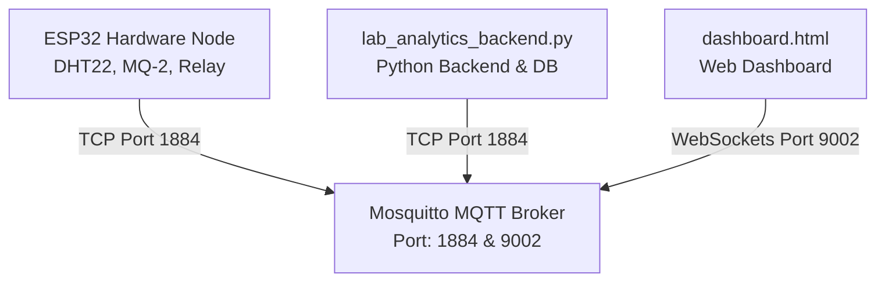

# HƯỚNG DẪN VẬN HÀNH MÁY CHỦ BIÊN CỤC BỘ (LOCAL EDGE SERVER)
> [!NOTE]  
> Tài liệu này hướng dẫn chi tiết cách chạy hệ thống giám sát phòng Lab thông qua máy chủ biên cục bộ (Laptop của bạn giả lập Raspberry Pi) sử dụng **Mosquitto Broker** nội bộ với mức bảo mật và độ ổn định cao nhất, không cần quyền Quản trị (Admin) và không phụ thuộc vào internet.

---

## 🛠️ Kiến Trúc Hệ Thống Cục Bộ



---

## 📋 Thông Số Cấu Hình Đã Thiết Lập

Chúng tôi đã tự động cấu hình toàn bộ hệ thống của bạn theo thông số mạng thực tế trên laptop của bạn:
*   **IP máy tính (Server IP):** `192.168.1.91`
*   **Cổng MQTT TCP (cho ESP32 & Backend):** `1884` (Tránh xung đột với cổng `1883` mặc định của Windows Service)
*   **Cổng MQTT WebSockets (cho Dashboard):** `9002`

---

## 🚀 Các Bước Chạy Hệ Thống

Hệ thống hỗ trợ **2 chế độ vận hành** tùy chỉnh theo nhu cầu của bạn. Trước khi bắt đầu, bạn bắt buộc phải làm bước chuẩn bị (Khởi động Broker):

### 🔑 Bước chuẩn bị: Khởi động MQTT Broker nội bộ
Broker cục bộ đã được cấu hình an toàn tại `C:\Users\PC\Downloads\local_mosquitto.conf`.

*   **Nếu dùng PowerShell (PS):**
    ```powershell
    & "C:\Program Files\mosquitto\mosquitto.exe" -c C:\Users\PC\Downloads\local_mosquitto.conf -v
    ```
*   **Nếu dùng Command Prompt (CMD):**
    ```cmd
    "C:\Program Files\mosquitto\mosquitto.exe" -c C:\Users\PC\Downloads\local_mosquitto.conf -v
    ```
> [!TIP]
> Khi chạy thành công, bạn sẽ thấy log thông báo mở cổng `1884` và cổng `9002`. Hãy giữ cửa sổ này chạy ngầm suốt quá trình vận hành!

---

## 💡 LỰA CHỌN 1: CHẠY HỢP NHẤT AIoT (Khuyên dùng - Đầy đủ AI & Chatbot)
> Chế độ này là giải pháp **cao cấp và toàn diện nhất** của Đồ án. Bạn chỉ cần chạy đúng 1 lệnh duy nhất, tích hợp sẵn Trí tuệ nhân tạo Gemini AI và Chatbot tự trị điều khiển từ xa.

### Bước 1: Khởi động Hệ thống Hợp nhất
1. Mở một Terminal mới (CMD hoặc PowerShell).
2. Di chuyển vào thư mục dự án và khởi động:
   ```powershell
   cd "C:\Users\PC\Downloads\DADN\DADN\server"
   $env:PYTHONIOENCODING="utf-8"
   python smart_lab_system.py
   ```
   *(Hệ thống sẽ tự động chạy ngầm luồng giả lập cảm biến và luồng lắng nghe Telegram Bot mà bạn không cần mở thêm bất kỳ terminal nào khác)*.

### Bước 2: Tương tác qua Chatbot Telegram & Web Dashboard
*   **Nhận đường dẫn tự động:** Ngay khi hệ thống chạy trực tuyến thành công, Chatbot sẽ lập tức gửi một tin nhắn chào mừng lên Telegram của bạn, đính kèm link mở Web Dashboard cục bộ (`file:///C:/Users/PC/Downloads/DADN/DADN/dashboard/dashboard.html`). Bạn chỉ cần copy/click để mở trực tiếp trên máy tính!
*   **Hỏi nhanh đường dẫn:** Chatbot hỗ trợ lệnh `/dashboard`. Gõ `/dashboard` trên điện thoại bất cứ lúc nào, bot sẽ gửi lại link mở giao diện cho bạn.
*   **Các câu lệnh hữu ích khác:**
    *   `/status`: Xem nhanh thông số Nhiệt độ, Độ ẩm, Khí Gas và trạng thái Quạt.
    *   `/report`: Yêu cầu AI Gemini phân tích an toàn phòng Lab chuyên sâu và đưa ra khuyến nghị.
    *   `bật quạt` / `tắt quạt`: Ra lệnh trực tiếp bằng tiếng Việt tự do (AI cục bộ hoặc Gemini AI sẽ tự động hiểu và điều khiển quạt ngắt/bật).

---

## 🛠️ LỰA CHỌN 2: CHẠY TÁCH BIỆT 3 TERMINAL (Cơ bản - Logic truyền thống)
> Chế độ này sử dụng logic so sánh ngưỡng cơ bản, không có AI phân tích và yêu cầu bạn quản lý độc lập từng luồng chương trình.

### Bước 1: Chạy Backend xử lý dữ liệu
1. Mở cửa sổ Terminal thứ hai.
2. Di chuyển vào thư mục dự án và chạy:
   ```powershell
   cd "C:\Users\PC\Downloads\DADN\DADN\server"
   python lab_analytics_backend.py
   ```

### Bước 2: Chạy thiết bị gửi dữ liệu (Simulator hoặc ESP32 thật)
*   **Nếu dùng Simulator (Giả lập để test):**
    1. Mở cửa sổ Terminal thứ ba.
    2. Chạy lệnh:
       ```powershell
       cd "C:\Users\PC\Downloads\DADN\DADN\server"
       python esp32_simulator.py
       ```
*   **Nếu dùng Thiết bị ESP32 thật:**
    1. Đấu nối phần cứng (DHT22 $\rightarrow$ GPIO 4, MQ-2 $\rightarrow$ GPIO 34, Relay $\rightarrow$ GPIO 27, Buzzer $\rightarrow$ GPIO 26).
    2. Sử dụng phần mềm **Thonny** nạp file `main.py` từ thư mục `firmware/` vào mạch dưới tên `main.py`. ESP32 sẽ tự động kết nối WiFi và đẩy dữ liệu trực tiếp về máy tính.

### Bước 3: Mở Dashboard giám sát
1. Mở trình duyệt (Chrome/Edge), nhấn `Ctrl + O` và chọn file `C:\Users\PC\Downloads\DADN\DADN\dashboard\dashboard.html`.
2. Dashboard sẽ chuyển trạng thái sang **Online** (Màu xanh lá) hiển thị các thông số tức thời.

---

## 🏆 Điểm Cộng Lớn Khi Báo Cáo Hội Đồng Đồ Án
Khi trình bày với thầy cô về giải pháp này, bạn hãy nhấn mạnh các ưu điểm kiến trúc:
1. **Tính độc lập & bảo mật cao:** Dữ liệu hoàn toàn chạy nội bộ trong mạng Lab, không bị gửi lên mây công cộng, bảo vệ thông tin thí nghiệm nhạy cảm.
2. **Khả năng tự phục hồi (Fault Tolerance):** Nếu mất kết nối Internet bên ngoài, hệ thống cảnh báo và điều khiển tự động cục bộ (như bật quạt khi gas cao) vẫn hoạt động hoàn hảo 100%.
3. **Sẵn sàng chuyển đổi (Production-Ready):** Kiến trúc phần mềm chạy trên laptop này giống hệt trên **Raspberry Pi**, cho phép đóng gói thành sản phẩm thương mại chỉ trong vài phút.
